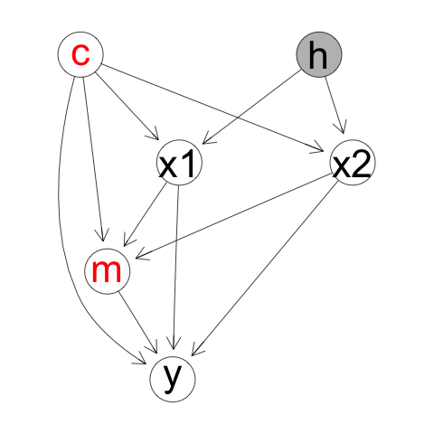

## Multiple Mediation Analysis with Nonlinear Models




Fit mediation models to assess the causal impact of **x** on **y** mediated through **m**. Implements models and algorithms described in Long et al. 2019+.

### Installation

Install from github using R `devtools`

``` r
devtools::install_github("longjp/mediateR")
```

or in a terminal

``` r
git clone https://github.com/longjp/mediateR.git
R CMD INSTALL mediateR
```

### Examples

See the vignettes:

* [Introduction](https://longjp.github.io/mediateR/intro.html)
* [Multiple Mediators](https://longjp.github.io/mediateR/multiple_mediators.html)

For reproducing all results in the paper, see the github repo [mediateR_paper](https://github.com/longjp/mediateR_paper)

### Citation and Contact

This code was developed for and described in Long et al. 2019+. Email jplong@mdanderson.org with questions or bug reports.
