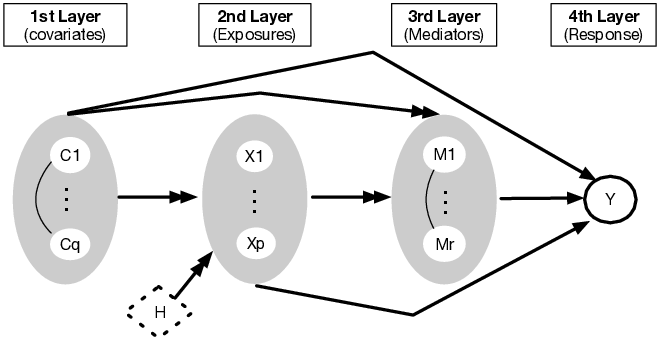

## mediateR




Fit mediation models to assess the causal impact of **x** on **y** mediated through **m**. 

### Installation

Install from github using R `devtools`

``` r
devtools::install_github("longjp/mediateR")
```

or in a terminal

``` r
git clone https://github.com/longjp/mediateR.git
R CMD INSTALL mediateR
```

### Examples

See the vignettes:

* [Multiple Mediators](https://htmlpreview.github.io/?https://github.com/longjp/mediateR/blob/master/vignettes/multiple_mediators.html)


