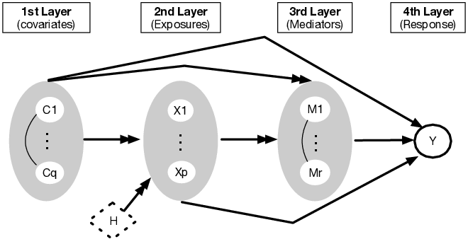
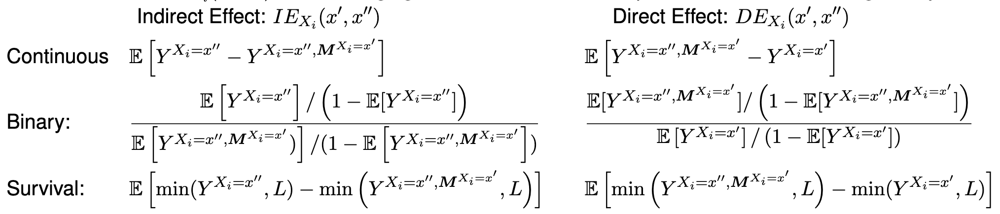
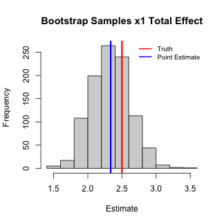
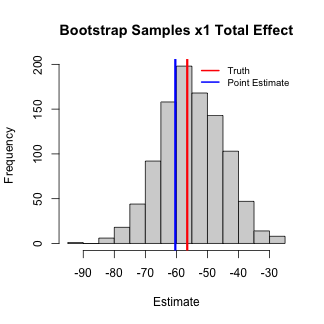
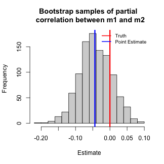

<style>
.footer {
    color: black;
    background: #E8E8E8;
    position: fixed;
    top: 90%;
    text-align:center;
    width:100%;
}
</style>

<style>
.small-code pre code {
  font-size: 1em;
}
</style>

<style>
.midcenter {
    position: fixed;
    top: 50%;
    left: 50%;
}
</style>

Mediation Analysis with mediateR
========================================================
author: Min Jin Ha, PhD
date: 
autosize: true

Outline
========================================================

- Installation
- Data Structure
- Mediation Analysis Framework
- Examples in R
  - Linear
  - Survival

Installation
========================================================
class: small-code

Install `mediateR` from github using R devtools

```r
install.packages("devtools")
devtools::install_github("longjp/mediateR")
```

Alternatively, install it from github in a terminal

```
$ git clone https://github.com/longjp/mediateR.git
$ R CMD INSTALL mediateR
```

Load the R package `mediateR`. 


```r
library(mediateR)
set.seed(2022)
```

Data Structure
========================================================
class: small-code

The `mediateR` contains functions to simulate data for mediation analysis. The following code simulates 2 observations with 3 exposures and 2 mediators for linear outcome model. 


```r
params <- mediateR:::QuickSim(n=2,nxx=3,nmm=2,family="gaussian")
dat <- SimulateData(params)
```

One can manually create a list with these elements or rely on the simulation function `SimulateData` to create the structure. The argument to `SimulateData` has parameters controlling the sample size, coefficient estimates, number of mediators, etc.

Data Structure: Example
========================================================
class: small-code

<small>`dat$y`:  response</small>


```r
dat$y
```

```
[1] 7.336213 1.446297
```

<small>`dat$mm`:  mediators</small>


```r
dat$mm
```

```
             m1         m2
[1,] -0.2584175  2.0061857
[2,]  0.3148540 -0.4818267
```
***
<small>`dat$xx`:  exposures</small> 


```r
dat$xx
```

```
     x1 x2 x3
[1,]  0  1  1
[2,]  1  0  1
```

<small>`dat$family`:  data type of response</small>


```r
dat$family
```

```
[1] "gaussian"
```

Mediation Analysis
========================================================

The goal is to assess the causal impact of exposure (`dat$xx`) on response (`dat$y`) and quantify how much of this effect passes through mediators (`dat$mm`), adjusting for covariates (`dat$co`). 

<div class="midcenter" style="margin-left:-300px; margin-top:-100px;">
</img>
</div>

Counterfactual Notations
========================================================

Counterfactual random variables are used to formally define causal interventions and the notions of direct and indirect effects. 

Let $Y^{X=x'}$ be the value of $Y$ obtained by setting $X=x'$ , possibly counter to fact. For notational simplicity, we will write $Y^{x'}$ when it is clear that $X$ is being set to $x'$ . 

Counterfactual notation can also express interventions on multiple variables. For example $Y^{x'',M^{x'}}$, the value $Y$ would have obtained had $X$ been set to $x''$ and had $M$ been set to the value it would have obtained had $x$ been set to $x'$. 

Direct and Indirect Effect
========================================================

The direct effect $DE_{X_i}(x',x'')$ and indirect effect $IE_{X_i}(x',x'')$  when changing $X_i$ from $x'$ to $x''$ with respect to mediators $M$ are given by:

<div class="midcenter" style="margin-left:-450px; margin-top:-100px;max-width: 100%;height: auto;">
</img>
</div>


Probability Model
========================================================
Mediator model:
$$\boldsymbol{m} = \boldsymbol{\beta}^{(X)}\boldsymbol{x} + \boldsymbol{\beta}^{(C)}\boldsymbol{c}+ \boldsymbol{\beta}^{(0)} + \boldsymbol{\epsilon}$$

Outcome model: 

- Linear:
$$y = \boldsymbol{x}^T \boldsymbol{\alpha}^{(X)} + \boldsymbol{m}^T \boldsymbol{\alpha}^{(M)}  + \boldsymbol{c}^T \boldsymbol{\alpha}^{(C)} + \alpha^{(0)} + \delta$$

- Logistic:
$$Y \sim Bernoulli(p), 
logit(p)  = \boldsymbol{x}^T \boldsymbol{\alpha}^{(X)} + \boldsymbol{m}^T \boldsymbol{\alpha}^{(M)}  + \boldsymbol{c}^T \boldsymbol{\alpha}^{(C)} + \alpha^{(0)}, $$

- Cox proportional hazards:
$$h(y|\boldsymbol{x},\boldsymbol{m},\boldsymbol{c}) = h_0(y)e^{\boldsymbol{x}^T \boldsymbol{\alpha}^{(X)} + \boldsymbol{m}^T \boldsymbol{\alpha}^{(m)}  + \boldsymbol{c}^T \boldsymbol{\alpha}^{(C)}}$$

Computation and Hypothesis Testing
========================================================
Parameter estimation:
  - Generalized linear model or Cox proportional hazard model
  - Ridge penalty is incorporated for high-dimensional mediators

Monte Carlo sampling to approximate the direct/indirect effects:
  - Relax the “rare outcome” assumption

We propose computing confidence intervals and hypothesis tests using bootstrap quantiles.

Example: Linear Model
========================================================
class: small-code

The following code simulates 500 observations with 3 exposures and 3 mediators for linear outcome model. 


```r
sim_params <- mediateR:::QuickSim(500,3,3,"gaussian")
dat <- SimulateData(sim_params)
```

`ComputePath` is used to fit the mediation analysis framework for various response, where `dat` are the list with the format mentioned above, `mmn=F` assuming independent mediators and `reg=T` is used for high-dimensional mediators (default is false).

```r
fit <- ComputePath(dat, mmn = T)
```

Linear - Model fitting
========================================================
class: small-code

`ComputeEffectsLinear` provides estimation of direct, indirect and total effect for linear model. Plugging in the true parameters `sim_params` gives the true effects.

```r
eff_est <- ComputeEffectsLinear(fit)
eff <- ComputeEffectsLinear(sim_params)

library(kableExtra)
eff_comb <- matrix(0,nrow(eff),ncol=2*ncol(eff))
for(ii in 1:ncol(eff)){
  eff_comb[,2*ii-1] <- eff_est[,ii]; eff_comb[,2*ii] <- eff[,ii]
}
for(ii in (ncol(dat$xx)+1):(ncol(dat$xx)+ncol(dat$mm))){
  eff_comb[ii,3:ncol(eff_comb)] <- NA
}
colnames(eff_comb) <- rep(c("Estimated","True"),ncol(eff)); rownames(eff_comb) <- rownames(eff)
```

Linear - Direct and Indirect Effect
========================================================
class: small-code

Table below summarizes the Indirect, Direct, and Total effects. 


```r
kable(eff_comb[1:ncol(dat$xx),],digits=2, format = "html", excape="T") %>%
  kable_styling(bootstrap_options = "striped", full_width = T) %>%
  add_header_above(c(" ", "Direct" = 2, "Indirect" = 2, "Total" = 2))
```

<table class="table table-striped" style="margin-left: auto; margin-right: auto;">
 <thead>
<tr>
<th style="empty-cells: hide;border-bottom:hidden;" colspan="1"></th>
<th style="border-bottom:hidden;padding-bottom:0; padding-left:3px;padding-right:3px;text-align: center; " colspan="2"><div style="border-bottom: 1px solid #ddd; padding-bottom: 5px; ">Direct</div></th>
<th style="border-bottom:hidden;padding-bottom:0; padding-left:3px;padding-right:3px;text-align: center; " colspan="2"><div style="border-bottom: 1px solid #ddd; padding-bottom: 5px; ">Indirect</div></th>
<th style="border-bottom:hidden;padding-bottom:0; padding-left:3px;padding-right:3px;text-align: center; " colspan="2"><div style="border-bottom: 1px solid #ddd; padding-bottom: 5px; ">Total</div></th>
</tr>
  <tr>
   <th style="text-align:left;">   </th>
   <th style="text-align:right;"> Estimated </th>
   <th style="text-align:right;"> True </th>
   <th style="text-align:right;"> Estimated </th>
   <th style="text-align:right;"> True </th>
   <th style="text-align:right;"> Estimated </th>
   <th style="text-align:right;"> True </th>
  </tr>
 </thead>
<tbody>
  <tr>
   <td style="text-align:left;"> x1 </td>
   <td style="text-align:right;"> 1.05 </td>
   <td style="text-align:right;"> 1 </td>
   <td style="text-align:right;"> 1.29 </td>
   <td style="text-align:right;"> 1.5 </td>
   <td style="text-align:right;"> 2.34 </td>
   <td style="text-align:right;"> 2.5 </td>
  </tr>
  <tr>
   <td style="text-align:left;"> x2 </td>
   <td style="text-align:right;"> 1.07 </td>
   <td style="text-align:right;"> 1 </td>
   <td style="text-align:right;"> 0.32 </td>
   <td style="text-align:right;"> 0.0 </td>
   <td style="text-align:right;"> 1.39 </td>
   <td style="text-align:right;"> 1.0 </td>
  </tr>
  <tr>
   <td style="text-align:left;"> x3 </td>
   <td style="text-align:right;"> 0.85 </td>
   <td style="text-align:right;"> 1 </td>
   <td style="text-align:right;"> 1.41 </td>
   <td style="text-align:right;"> 1.5 </td>
   <td style="text-align:right;"> 2.26 </td>
   <td style="text-align:right;"> 2.5 </td>
  </tr>
</tbody>
</table>

 - $x_1$ has a total effect 2.34 on response, with the indirect effect to be 1.29.

Linear - Bootstrap 
========================================================
class: small-code

We propose computing confidence intervals and hypothesis tests using bootstrap sampling quantiles.

The following code compute the confidence interval of total effect of x1 on the response. 


```r
B <- 1000
eff_est_boot <- vector("list",length=B)
for(ii in 1:B){
  ix <- sample(1:sim_params$n,replace=TRUE)
  dat_sub <- mediateR:::SubsetDat(dat,ix)
  fit <- ComputePath(dat_sub, mmn = T)
  eff_est_boot[[ii]] <- ComputeEffectsLinear(fit)
}
total_xx1 <- vapply(eff_est_boot,function(x){x[1,3]},c(0)) #x1 Total
#indirect_xx1 <- vapply(eff_est_boot,function(x){x[1,2]},c(0)) #x1 Indirect
CI95 = round(quantile(total_xx1, c(0.025, 1 - 0.025)),2)
```


Linear - Bootstrap 
========================================================
class: small-code

Figure below shows the histogram of total effects of Bootstrap samples for $x_1$ The 95% CI of the total effect for $x_1$ is (1.8, 2.89)  


```r
hist(total_xx1,main="Bootstrap Samples x1 Total Effect",xlab="Estimate")
abline(v=eff[1,3],lwd=3,col='red')
abline(v=eff_est[1,3],lwd=3,col='blue')
legend("topright",c("Truth","Point Estimate"),col=c("red","blue"),lwd=2, bty="n", cex=0.8)
```




Example: Survival
========================================================
class: small-code

Same as previous simulation but with exponentially distributed survival times. The rate is $e^{\beta^Tx}$ where $x$ are the covariates. The following code simulates 500 observations with 3 exposures and 3 mediators for survival outcome model.


```r
sim_params$family <- "cox"
dat <- SimulateData(sim_params)
rmean <- max(as.matrix(dat$y)[,1])
```

 This model can be fit with Cox Proportional Hazards. We compute the effects on mean survival restricted to 284 days.


```r
fit <- ComputePath(dat, mmn = T)
```


Survival - Direct and Indirect Effect
========================================================
class: small-code

<small>Given the simulation setting, we approximate true effects by approximating integral with large sample size use the maximum observed time (284 days) as the restricted mean time.</small> 


```r
sim_params2 <- sim_params
sim_params2$n <- 1e4 # use many observations to approximate true effects
dat2 <- SimulateData(sim_params2)
fit2 <- ComputePath(dat2, mmn = T) 
direct_t <- ComputeEffectxx(dat2,fit2,"direct",rmean=rmean)
indirect_t <- ComputeEffectxx(dat2,fit2,"indirect",rmean=rmean)
total_t <- ComputeEffectxx(dat2,fit2,"total",rmean=rmean)
```

<small>Similarly, `ComputeEffectxx` provides estimation of direct, indirect and total effect.</small> 


```r
direct <- ComputeEffectxx(dat,fit,"direct",rmean=rmean)
indirect <- ComputeEffectxx(dat,fit,"indirect",rmean=rmean)
total <- ComputeEffectxx(dat,fit,"total",rmean=rmean)
eff_comb <- cbind(direct,direct_t,indirect,indirect_t,total,total_t)
rownames(eff_comb) <- names(fit$xx_direct)
colnames(eff_comb) <- rep(c("Estimated","True"),3)
xx1total_sample <- eff_comb[1,5]
xx1total_true <- eff_comb[1,6]
```

Survival - Direct and Indirect Effect
========================================================
class: small-code

Table below summarizes the Indirect, Direct, and Total effects. 


```r
kable(eff_comb,digits=2) %>%
  kable_styling(bootstrap_options = "striped", full_width = F) %>%
  add_header_above(c(" ", "direct" = 2, "indirect" = 2, "total" = 2))
```

<table class="table table-striped" style="width: auto !important; margin-left: auto; margin-right: auto;">
 <thead>
<tr>
<th style="empty-cells: hide;border-bottom:hidden;" colspan="1"></th>
<th style="border-bottom:hidden;padding-bottom:0; padding-left:3px;padding-right:3px;text-align: center; " colspan="2"><div style="border-bottom: 1px solid #ddd; padding-bottom: 5px; ">direct</div></th>
<th style="border-bottom:hidden;padding-bottom:0; padding-left:3px;padding-right:3px;text-align: center; " colspan="2"><div style="border-bottom: 1px solid #ddd; padding-bottom: 5px; ">indirect</div></th>
<th style="border-bottom:hidden;padding-bottom:0; padding-left:3px;padding-right:3px;text-align: center; " colspan="2"><div style="border-bottom: 1px solid #ddd; padding-bottom: 5px; ">total</div></th>
</tr>
  <tr>
   <th style="text-align:left;">   </th>
   <th style="text-align:right;"> Estimated </th>
   <th style="text-align:right;"> True </th>
   <th style="text-align:right;"> Estimated </th>
   <th style="text-align:right;"> True </th>
   <th style="text-align:right;"> Estimated </th>
   <th style="text-align:right;"> True </th>
  </tr>
 </thead>
<tbody>
  <tr>
   <td style="text-align:left;"> x1 </td>
   <td style="text-align:right;"> -25.39 </td>
   <td style="text-align:right;"> -22.46 </td>
   <td style="text-align:right;"> -37.03 </td>
   <td style="text-align:right;"> -33.35 </td>
   <td style="text-align:right;"> -60.35 </td>
   <td style="text-align:right;"> -56.51 </td>
  </tr>
  <tr>
   <td style="text-align:left;"> x2 </td>
   <td style="text-align:right;"> -3.82 </td>
   <td style="text-align:right;"> -21.89 </td>
   <td style="text-align:right;"> 1.40 </td>
   <td style="text-align:right;"> -1.65 </td>
   <td style="text-align:right;"> -21.12 </td>
   <td style="text-align:right;"> -26.71 </td>
  </tr>
  <tr>
   <td style="text-align:left;"> x3 </td>
   <td style="text-align:right;"> -12.58 </td>
   <td style="text-align:right;"> -23.45 </td>
   <td style="text-align:right;"> -17.78 </td>
   <td style="text-align:right;"> -40.67 </td>
   <td style="text-align:right;"> -50.67 </td>
   <td style="text-align:right;"> -60.18 </td>
  </tr>
</tbody>
</table>

 - $x_1$ has a total effect of reducing mean restricted survival time by 60 days, with 37 days explained by changes in mediators. 

Survival - Bootstrap
========================================================
class: small-code

We propose computing confidence intervals and hypothesis tests using bootstrap sampling quantiles. 

The following code computes the confidence interval of total effect of x1 on the response. 


```r
B <- 1000
total_xx1 <- rep(0,length=B)
for(ii in 1:B){
  ix <- sample(1:sim_params$n,replace=TRUE)
  dat_boot <- mediateR:::SubsetDat(dat,ix)
  fit_boot <- ComputePath(dat_boot, mmn = T)
  total_xx1[ii] <- ComputeEffectxx(dat_boot,fit_boot,"total",rmean=rmean)[1] #total
}
CI95 = round(quantile(total_xx1, c(0.025, 1 - 0.025)),2)
```

Survival - Bootstrap
========================================================
class: small-code

Figure below shows the histogram of total effects of Bootstrap samples for $x_1$. The 95% CI of the total effect for $x_1$ is (-74.8, -35.52).


```r
hist(total_xx1,main="Bootstrap Samples x1 Total Effect",xlab="Estimate")
abline(v=xx1total_sample,lwd=3,col='blue')
abline(v=xx1total_true,lwd=3,col='red')
legend("topright",c("Truth","Point Estimate"),col=c("red","blue"),lwd=2, bty="n", cex=0.8)
```




Example: Mediator-mediator relations 
========================================================
class: small-code

 - <small>`fit$cov_mm` gives partial correlation between mediators adjusting for exposures and covariates.</small> 

```r
round(fit$cov,2)
```

```
      [,1]  [,2]  [,3]
[1,]  1.02  0.05 -0.06
[2,]  0.05  1.07 -0.01
[3,] -0.06 -0.01  1.08
```

*** 
 - <small> `fit$ivcor_mm` gives partial correlation between mediators adjusting for exposures, covariates and other mediators.</small>  


```r
round(fit$ivcor_mm,2)
```

```
      [,1]  [,2] [,3]
[1,]  1.00 -0.04 0.05
[2,] -0.04  1.00 0.00
[3,]  0.05  0.00 1.00
```


Mediator-mediator relations: Bootstrap
========================================================
class: small-code

Here we show how to compute confidence intervals using bootstrap sampling quantiles.


```r
corrmm <- array(0,dim = c(B, ncol(dat$mm),ncol(dat$mm)))
for(ii in 1:B){
  ix <- sample(1:sim_params$n,replace=TRUE)
  dat_boot <- mediateR:::SubsetDat(dat,ix)
  fit_boot <- ComputePath(dat_boot, mmn = T)
  corrmm[ii,,] <- fit_boot$ivcor_mm
}
CI95 = round(quantile(corrmm[,1,2], c(0.025, 1 - 0.025)),2)
```

Mediator-mediator relations: Bootstrap
========================================================
class: small-code

Figure below shows the histogram of partial correlation between m1 and m2 adjusting for other mediators, exposures and covariates. Its 95% CI is (-0.13, 0.05).    


```r
hist(corrmm[,1,2],main="Bootstrap samples of partial \n correlation between m1 and m2",xlab="Estimate")
abline(v=fit$ivcor_mm[1,2],lwd=3,col='blue')
abline(v=0,lwd=3,col='red')
legend("topright",c("Truth","Point Estimate"),col=c("red","blue"),lwd=2,  bty="n", cex=0.8)
```




========================================================
class: small-code

<div style="font-weight:bold;font-size:200%;position: fixed; top:10%; text-align:center;padding:1em;">Thank you!</div>

<div class="footer" style="margin-top:-50px;font-size:80%;">
For more tutorials, see <a href="https://htmlpreview.github.io/?https://github.com/longjp/mediateR/blob/master/vignettes/multiple_mediators.html">Multiple Mediation Analysis with mediateR.</a></div>

